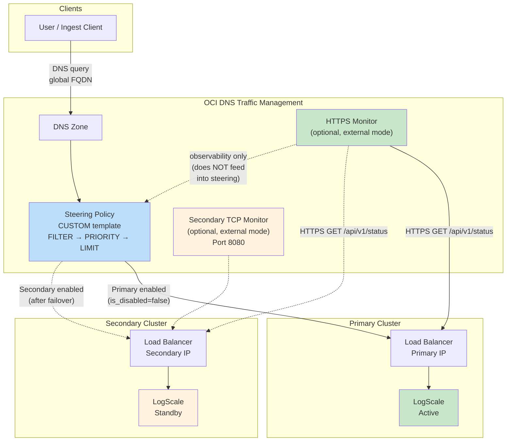
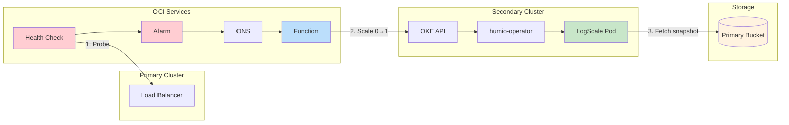
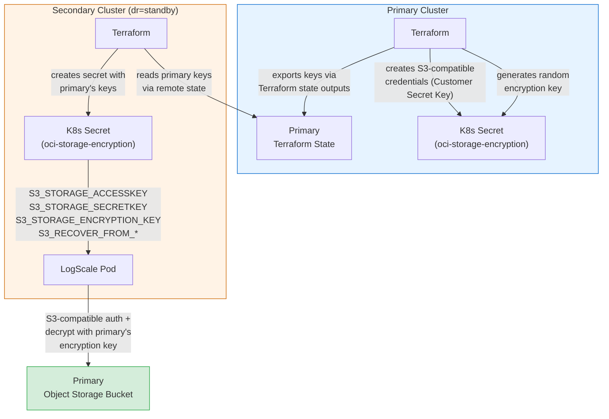
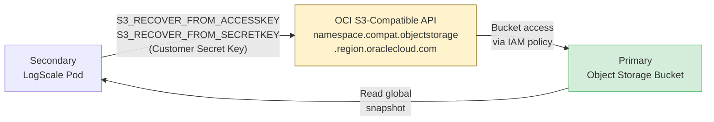
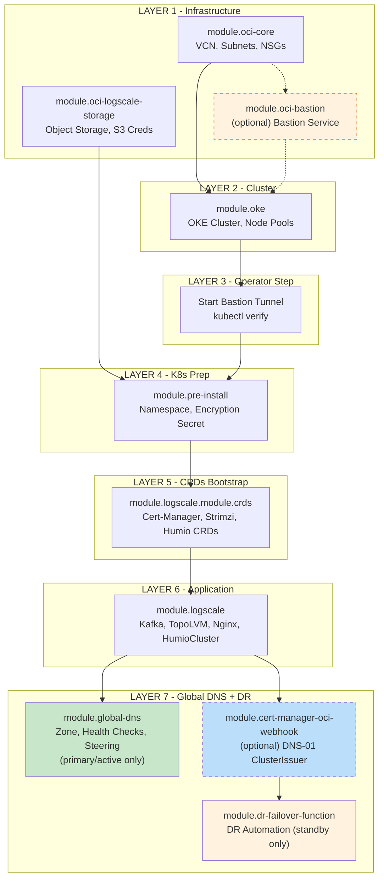
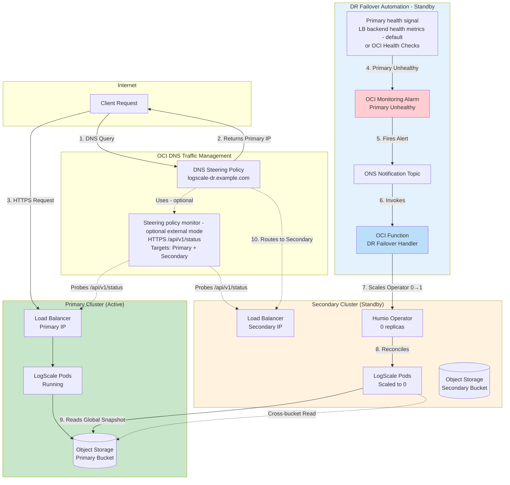
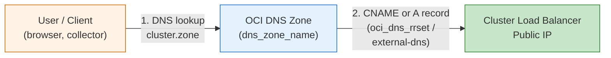
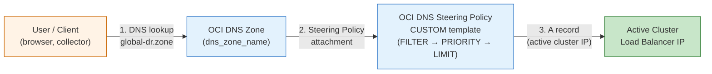
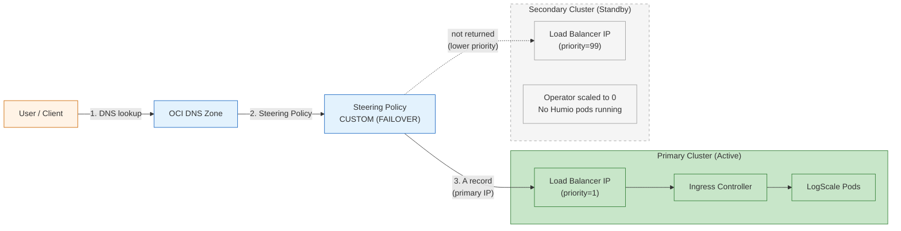
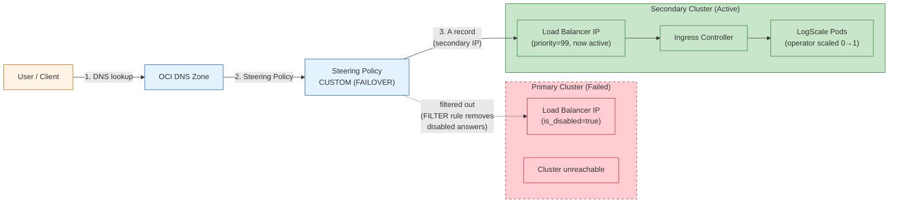

# Disaster Recovery (DR) Operations Guide for LogScale OCI

> **Prerequisite:** Deploy your primary cluster first using [DEPLOYMENT_GUIDE.md](DEPLOYMENT_GUIDE.md). This guide covers adding a standby (secondary) cluster and operating DR failover.

This guide explains how to set up Disaster Recovery (DR) for LogScale with Terraform across two OCI clusters (typically two OCI regions; the examples in this repo use the same region for simplicity) and how to promote the secondary cluster to active.

If you are actively responding to an incident, start with [Section 5.2. Stage 2 Failover](#52-stage-2-failover---scale-up-humio-and-read-global-snapshot).

## Table of Contents

<table>
<tr><th>Contents</th></tr>
<tr><td>1.&nbsp;&nbsp;<a href="#1-proposal">Proposal</a></td></tr>
<tr><td>2.&nbsp;&nbsp;<a href="#2-executive-summary">Executive Summary</a></td></tr>
<tr><td>&emsp;2.1&nbsp;&nbsp;<a href="#21-upstream-dr-procedure-and-this-implementation">Upstream DR Procedure and This Implementation</a></td></tr>
<tr><td>&emsp;2.2&nbsp;&nbsp;<a href="#22-key-design-decisions">Key Design Decisions</a></td></tr>
<tr><td>&emsp;2.3&nbsp;&nbsp;<a href="#23-key-capabilities">Key Capabilities</a></td></tr>
<tr><td>3.&nbsp;&nbsp;<a href="#3-dr-prerequisites">DR Prerequisites</a></td></tr>
<tr><td>&emsp;3.1&nbsp;&nbsp;<a href="#31-additional-iam-permissions">Additional IAM Permissions</a></td></tr>
<tr><td>&emsp;3.2&nbsp;&nbsp;<a href="#32-encryption-key-requirements">Encryption Key Requirements</a></td></tr>
<tr><td>&emsp;3.3&nbsp;&nbsp;<a href="#33-dr-pre-deployment-checklist">DR Pre-Deployment Checklist</a></td></tr>
<tr><td>4.&nbsp;&nbsp;<a href="#4-dr-terraform-configuration">DR Terraform Configuration</a></td></tr>
<tr><td>&emsp;4.1&nbsp;&nbsp;<a href="#41-dr-modules">DR Modules</a></td></tr>
<tr><td>&emsp;&emsp;4.1.1&nbsp;&nbsp;<a href="#411-global-dns-moduleglobal-dns">Global DNS (<code>module.global-dns</code>)</a></td></tr>
<tr><td>&emsp;&emsp;4.1.2&nbsp;&nbsp;<a href="#412-dr-failover-function-moduledr-failover-function">DR Failover Function (<code>module.dr-failover-function</code>)</a></td></tr>
<tr><td>&emsp;&emsp;4.1.3&nbsp;&nbsp;<a href="#413-oci-object-storage-for-dr">OCI Object Storage for DR</a></td></tr>
<tr><td>&emsp;&emsp;4.1.4&nbsp;&nbsp;<a href="#414-oke-node-pool-topology--dr-modes">OKE Node Pool Topology &mdash; DR Modes</a></td></tr>
<tr><td>&emsp;4.2&nbsp;&nbsp;<a href="#42-workspace-setup-for-dr-pairs">Workspace Setup for DR Pairs</a></td></tr>
<tr><td>&emsp;4.3&nbsp;&nbsp;<a href="#43-remote-state-data-flow">Remote State Data Flow</a></td></tr>
<tr><td>&emsp;4.4&nbsp;&nbsp;<a href="#44-module-deployment-matrix">Module Deployment Matrix</a></td></tr>
<tr><td>&emsp;4.5&nbsp;&nbsp;<a href="#45-module-dependency-graph">Module Dependency Graph</a></td></tr>
<tr><td>&emsp;4.6&nbsp;&nbsp;<a href="#46-primary-cluster--dr-specific-settings">Primary Cluster &mdash; DR-Specific Settings</a></td></tr>
<tr><td>&emsp;4.7&nbsp;&nbsp;<a href="#47-secondary-cluster-deployment">Secondary Cluster Deployment</a></td></tr>
<tr><td>5.&nbsp;&nbsp;<a href="#5-dr-failover">DR Failover</a></td></tr>
<tr><td>&emsp;5.1&nbsp;&nbsp;<a href="#51-stage-1-dr-provisioning-and-standby-readiness">Stage 1: DR Provisioning and Standby Readiness</a></td></tr>
<tr><td>&emsp;&emsp;5.1.1&nbsp;&nbsp;<a href="#511-oci-dr-recovery-environment-variables">OCI DR Recovery Environment Variables</a></td></tr>
<tr><td>&emsp;5.2&nbsp;&nbsp;<a href="#52-stage-2-failover---scale-up-humio-and-read-global-snapshot">Stage 2: Failover - Scale up Humio and read global snapshot</a></td></tr>
<tr><td>&emsp;&emsp;5.2.1&nbsp;&nbsp;<a href="#521-secondary-readiness-required-steps">Secondary Readiness Required Steps</a></td></tr>
<tr><td>&emsp;&emsp;5.2.2&nbsp;&nbsp;<a href="#522-dns-architecture-and-traffic-flow">DNS Architecture and Traffic Flow</a></td></tr>
<tr><td>&emsp;&emsp;5.2.3&nbsp;&nbsp;<a href="#523-traffic-routing-during-failover">Traffic Routing During Failover</a></td></tr>
<tr><td>&emsp;&emsp;5.2.4&nbsp;&nbsp;<a href="#524-verify-dr-recovery-succeeded">Verify DR Recovery Succeeded</a></td></tr>
<tr><td>&emsp;5.3&nbsp;&nbsp;<a href="#53-stage-3-promote-secondary-to-active">Stage 3: Promote Secondary to Active</a></td></tr>
<tr><td>&emsp;&emsp;5.3.1&nbsp;&nbsp;<a href="#531-zero-downtime-promotion-two-phase-apply">Zero-Downtime Promotion (Two-Phase Apply)</a></td></tr>
<tr><td>&emsp;&emsp;5.3.2&nbsp;&nbsp;<a href="#532-dns-steering-policy-behavior-during-dr">DNS Steering Policy Behavior During DR</a></td></tr>
<tr><td>&emsp;&emsp;5.3.3&nbsp;&nbsp;<a href="#533-s3_recover_from_-environment-variable-preservation">S3_RECOVER_FROM_* Environment Variable Preservation</a></td></tr>
<tr><td>&emsp;5.4&nbsp;&nbsp;<a href="#54-failover-timing-summary">Failover Timing Summary</a></td></tr>
<tr><td>&emsp;&emsp;5.4.1&nbsp;&nbsp;<a href="#541-overview">Overview</a></td></tr>
<tr><td>&emsp;&emsp;5.4.2&nbsp;&nbsp;<a href="#542-failover-timing-breakdown">Failover Timing Breakdown</a></td></tr>
<tr><td>&emsp;&emsp;5.4.3&nbsp;&nbsp;<a href="#543-configuration-variables">Configuration Variables</a></td></tr>
<tr><td>&emsp;&emsp;5.4.4&nbsp;&nbsp;<a href="#544-how-the-holdoff-works">How the Holdoff Works</a></td></tr>
<tr><td>&emsp;&emsp;5.4.5&nbsp;&nbsp;<a href="#545-total-expected-time-detection--function-complete">Total Expected Time (Detection &rarr; Function Complete)</a></td></tr>
<tr><td>&emsp;&emsp;5.4.6&nbsp;&nbsp;<a href="#546-post-failover-timeline">Post-Failover Timeline</a></td></tr>
<tr><td>&emsp;&emsp;5.4.7&nbsp;&nbsp;<a href="#547-end-to-end-timeline-summary">End-to-End Timeline Summary</a></td></tr>
<tr><td>&emsp;&emsp;5.4.8&nbsp;&nbsp;<a href="#548-configuring-for-testing-vs-production">Configuring for Testing vs Production</a></td></tr>
<tr><td>6.&nbsp;&nbsp;<a href="#6-additional-resources">Additional Resources</a></td></tr>
</table>


## 1. Proposal

**Objective**

* Bootstrap a new LogScale cluster on OKE based on another cluster's bucket storage, using LogScale's native [disaster recovery method](https://library.humio.com/deployment/cluster-management-storage-bucket.html#cluster-management-storage-bucket-start-another-cluster), and provide a clear, repeatable procedure to configure the DR pair (primary + secondary) with Terraform, validate the secondary is ready, and promote it to active when required.

**Audience**

* DevOps engineers with OCI and Terraform access.

**Scope**

* In scope:
  + Terraform workspaces and DR-specific variables (`dr`, `dr_primary_bucket_name`, `primary_remote_state_config`, etc.).
  + Encryption-key synchronization via remote state and Kubernetes secrets.
  + DR environment variables on the HumioCluster (`S3_RECOVER_FROM_*`, `ENABLE_ALERTS`, etc.).
  + Verification steps, failover flow (Humio pod + snapshot), and promotion from standby to active.
* Out of scope:
  + Foundational OCI networking/bootstrap (VCN, subnets, base OKE cluster, shared DNS/account setup).
  + Automatic replication of LogScale assets (repositories, saved searches, alerts, dashboards, widgets, etc.) between clusters.
  + Automatic synchronization of Kubernetes secrets referenced by the HumioCluster (OAuth/SAML, SMTP/Postmark, ingest tokens, custom application secrets); these must be copied manually as noted later in this guide.
  + Client application changes or reconfiguration of producers/senders beyond pointing them at the global DR FQDN.
  + Detailed DR procedures for non-OCI environments (this guide focuses on OCI DNS Steering Policy + OKE).

**Success criteria**

* With `dr="standby"`, the secondary cluster is fully provisioned (Kafka, ingress, cert-manager) and **ready** to start LogScale on failover; LogScale pods remain scaled to 0 until the operator is scaled up.
* After failover (operator scaled 0 &rarr; 1), the secondary LogScale pod fetches the global snapshot from the PRIMARY Object Storage bucket and becomes Ready.

## 2. Executive Summary

This implementation bootstraps a standby LogScale cluster on OKE that can take over from a failed primary using LogScale's native bucket storage disaster recovery method, as documented in [Start a new LogScale cluster based on another with buckets](https://library.humio.com/deployment/cluster-management-storage-bucket.html#cluster-management-storage-bucket-start-another-cluster). LogScale supports bootstrapping a fully independent cluster from the bucket storage of an existing cluster -- the new cluster treats the source bucket as read-only and uses its own bucket for new writes.

Two clusters are managed via Terraform workspaces:

* Primary: production, `dr="active"`.
* Secondary: standby, `dr="standby"`, minimal capacity, reads the primary's Object Storage bucket using the exact same encryption key pulled via remote state, and keeps all LogScale pods scaled to zero until a failover/promotion is initiated.

### 2.1 Upstream DR Procedure and This Implementation

The upstream procedure requires a single node started with an empty data directory, a fresh Kafka cluster with no existing LogScale topics, no pre-existing `global-data-snapshot.json`, an empty target bucket, and `S3_RECOVER_FROM_*` environment variables pointing to the source cluster's bucket storage. During recovery, the new node fetches the latest `global-snapshot.json` from the source bucket and rewrites it: dropping all host entries, resetting partition tables, clearing segment ownership, and creating the required Kafka topics. The recovered cluster then fetches segment files from the source bucket on demand and uploads them to its own target bucket over time, eventually becoming fully independent.

**How this repo implements the upstream procedure:**

| Upstream Requirement | This Implementation |
| --- | --- |
| Single node, empty data directory | Standby HumioCluster declares `nodeCount=1`; Humio operator is scaled to 0 replicas until failover. When scaled up, a fresh pod starts with empty ephemeral storage |
| Fresh Kafka cluster | Each OKE cluster runs its own independent Strimzi-managed Kafka cluster |
| No existing snapshot | Standby cluster has never run LogScale; no local snapshot exists |
| Empty target bucket | `module.oci-logscale-storage` creates a dedicated bucket per cluster (`dr-secondary-logscale-data`) |
| `S3_RECOVER_FROM_*` env vars | Automatically set by Terraform from primary remote state outputs (`S3_RECOVER_FROM_BUCKET`, `S3_RECOVER_FROM_ENDPOINT_BASE`, `S3_RECOVER_FROM_REGION`, etc.) |
| `S3_RECOVER_FROM_REPLACE_*` patterns | Set via tfvars (`s3_recover_from_replace_region`, `s3_recover_from_replace_bucket`) or auto-derived from remote state |
| Encryption key from source cluster | Synchronized via `terraform_remote_state` -- primary generates the key, secondary reads it and creates an identical Kubernetes secret |
| Extend to desired node count after recovery | Two-phase promotion: Phase 1 runs with single digest pod, Phase 2 scales to full production topology via `terraform apply` |

> **Important:** LogScale only supports AWS, Azure, GCP, or MinIO bucket storage. OCI Object Storage is accessed via its **S3-compatible API**, which is why all storage configuration in this repo uses `S3_STORAGE_*` / `S3_RECOVER_FROM_*` prefixes despite running on OCI.

> **Note:** The upstream documentation states that the source bucket must be **immutable** from the point the disaster recovery process starts. In a real disaster scenario (unplanned failover), the primary cluster is already unreachable, so no new writes occur. For planned failover or cloning, the primary should be shut down gracefully before initiating recovery to ensure the global snapshot references no missing segments.

### 2.2 Key Design Decisions

Region flexibility

* The regions shown are examples only. You can deploy in any OCI regions supported by your organization. Update `region` in your tfvars, the remote state configuration, and any region-specific references to match your chosen regions.

Key features

* Automated encryption key synchronization (no hardcoding). Standby apply requires the primary key (remote state or explicit value).
* Cross-region Object Storage access via IAM policies.
* Alerts toggle automatically via `ENABLE_ALERTS` based on `dr` (`true` for active, `false` for standby).
* Standby keeps Humio operator scaled to 0; OCI Function (or manual) scales the operator to 1 on failover. NodeCount is already set to 1 on the HumioCluster manifest; running `terraform apply` on the secondary automatically resets the operator to 0 replicas when `dr="standby"`.
* Manual, controlled promotion by changing `dr` and applying Terraform.

### 2.3 Key Capabilities

| Feature | Primary (Active) | Secondary (Standby) |
| --- | --- | --- |
| Region | `var.region` (any supported OCI region) | `var.region` (any supported OCI region) |
| Cluster Type | Advanced (full production) | Standby (Humio operator off) |
| Humio nodeCount | cluster_size digest count | nodeCount=1 declared, but no pods run until operator is scaled up |
| Humio operator | 1 replica | 0 replicas until failover |
| Replication Factor | Production value | 1 (overridden) |
| Auto Rebalance | Enabled | Disabled |
| Object Storage Bucket | `dr-primary-logscale-data` | `dr-secondary-logscale-data` |
| Encryption Key | Generated on first deploy | Pulled from primary state (required for standby apply) |
| Terraform Workspace | `primary` | `secondary` |
| DR Mode | `dr = "active"` | `dr = "standby"` |

> **Note:** The `dr` variable accepts three values:
> * `"active"` - Primary cluster in a DR pair
> * `"standby"` - Secondary cluster in a DR pair (minimal capacity, operator scaled to 0)
> * `""` (empty string) - Non-DR single cluster deployment (no DR infrastructure provisioned)

---

## 3. DR Prerequisites

In addition to the base prerequisites in [DEPLOYMENT_GUIDE.md - Prerequisites](DEPLOYMENT_GUIDE.md#2-prerequisites), DR deployments require the following.

**Additional software requirements:**

| Software | Minimum Version | Purpose |
| --- | --- | --- |
| Docker | Latest | DR failover function image build (standby only) |

### 3.1 Additional IAM Permissions

Beyond the base IAM policies listed in [DEPLOYMENT_GUIDE.md - IAM Permissions](DEPLOYMENT_GUIDE.md#23-iam-permissions), DR deployments require:

| Policy | Purpose |
| --- | --- |
| `manage functions-family in compartment` | OCI Functions for DR failover automation |
| `manage dns in compartment` | DNS zones, steering policies, health checks |
| `manage monitoring-family in compartment` | Alarms and metrics for DR automation |
| `manage ons-family in compartment` | ONS notification topics for alarm-to-function chain |
| `manage repos in compartment` | OCIR container repository for function images |
| `manage dynamic-groups in tenancy` | Dynamic groups for OCI Function resource principal auth |

**Automatic IAM for DR:** When deploying a standby cluster (`dr="standby"`), Terraform automatically creates:
* A dynamic group matching the DR failover function
* IAM policies allowing the function to access the OKE cluster API (scale operator)
* IAM policies allowing the function to update DNS steering policy answers

**Cross-region access:** DR recovery requires that the standby cluster's LogScale pod can read the primary bucket via OCI Object Storage's S3-compatible API. This repo assumes the required IAM permissions already exist (typically via compartment/tenancy policies for the Object Storage user used to generate S3 credentials).

### 3.2 Encryption Key Requirements

* Primary generates the encryption key via `module.pre-install` (using `random_password`) on first deploy
* Secondary receives the key automatically via `terraform_remote_state` (primary mechanism). The `existing_storage_encryption_key` variable is a fallback for environments where remote state is unavailable
* Keys are stored as Kubernetes secrets (`${cluster_name}-oci-storage-encryption`), never committed to version control
* Same key must be used across both clusters for DR recovery
* The encryption key is passed to LogScale via `S3_STORAGE_ENCRYPTION_KEY` environment variable (secretKeyRef)

### 3.3 DR Pre-Deployment Checklist

In addition to the checklist in [DEPLOYMENT_GUIDE.md - Pre-Deployment Checklist](DEPLOYMENT_GUIDE.md#26-pre-deployment-checklist):

* [ ] Terraform backend (OCI Object Storage state bucket) accessible from **both** regions
* [ ] `terraform workspace list` shows both `primary` and `secondary` workspaces
* [ ] OCI Functions enabled in the compartment (required for DR failover automation on standby)
* [ ] For standby deployment: primary encryption key available via remote state or `existing_storage_encryption_key`
* [ ] Docker installed and running locally (required for DR failover function image build on standby)

## 4. DR Terraform Configuration

This section covers the DR-specific Terraform modules, workspace setup, and deployment sequence for the secondary (standby) cluster. For base Terraform configuration (backend, workspace basics, validation), see [DEPLOYMENT_GUIDE.md - Terraform Configuration](DEPLOYMENT_GUIDE.md#3-terraform-configuration).

Key DR mechanisms managed by Terraform:

* **Encryption key synchronization** -- the primary generates the key; the secondary copies it via remote state. See [Section 4.1.3](#413-oci-object-storage-for-dr) for details.
* **Automated failover** -- an OCI Function scales the Humio operator from 0 to 1 when the primary becomes unhealthy. See [Section 4.1.2](#412-dr-failover-function-moduledr-failover-function) for the full event chain, timing, and configuration options.
* **`S3_RECOVER_FROM_*` environment variables** are set on the standby cluster at provisioning time but only consumed when the LogScale pod starts during failover.

### 4.1 DR Modules

For the base module descriptions (networking, storage, bastion, OKE, pre-install, logscale, cert-manager webhook), see [DEPLOYMENT_GUIDE.md - Modules](DEPLOYMENT_GUIDE.md#4-modules).

This section covers the DR-specific modules that automate failover operations. These modules are not used in standalone (`dr=""`) deployments.

**Why These Modules Are Needed:**

In a disaster recovery scenario, two things must happen quickly:

1. **Traffic must be redirected** from the failed primary cluster to the healthy secondary cluster
2. **The secondary cluster must start up** and begin serving requests

Without automation, an operator would need to manually update DNS records and scale up Kubernetes deployments. The modules below reduce this to under 10 minutes with no human intervention.

#### 4.1.1 Global DNS (`module.global-dns`)

**Purpose:** Provides automatic traffic failover between primary and secondary clusters using OCI DNS Steering Policy.

When users access your LogScale cluster, they use a single global DNS name (derived from `global_logscale_hostname` and `dns_zone_name`). This module creates an OCI DNS Steering Policy that continuously monitors both clusters' health. If the primary cluster becomes unhealthy, the steering policy (combined with the DR failover function) automatically routes all traffic to the secondary cluster.

**Deployed on:** Any DR cluster (`dr != ""`) when `manage_global_dns = true`. In practice, only set `manage_global_dns = true` on the primary (active) workspace to avoid two states managing the same DNS resources..
**Key resources created:**

| Resource | Purpose |
| --- | --- |
| `oci_dns_zone` | DNS zone for the global FQDN (optional, can use existing) |
| `oci_dns_steering_policy` | Failover routing between primary and secondary |
| `oci_dns_steering_policy_attachment` | Links the policy to the zone |
| `oci_health_checks_http_monitor` | HTTPS health check (optional, when `use_external_health_check=true`) |



**How it works:**

* The steering policy always uses **FILTER → PRIORITY → LIMIT** (no HEALTH rule). This prevents automatic failback — DNS stays on whichever cluster the DR function has directed traffic to until an operator manually fails back.
* The DR failover function controls routing by setting `is_disabled=true` on steering policy answers. The FILTER rule removes disabled answers, and the PRIORITY rule selects the highest-priority remaining answer.
* With `use_external_health_check=true`: OCI Health Check monitors are created for **observability only** (OCI console dashboards, DR function pre-validation). They do **not** influence DNS routing.
* With `use_external_health_check=false`: no health check monitors are created. Use this for firewall-restricted environments where external vantage points cannot reach endpoints.

**DNS Configuration:**

The ingress hostname is configured using `logscale_public_fqdn` for non-DR mode, or automatically derived from `${global_logscale_hostname}.${dns_zone_name}` when `dr` is set:

| DR Mode | Effective Hostname Used | Why |
| --- | --- | --- |
| `dr=""` (non-DR) | `logscale_public_fqdn` value | Direct cluster access, no failover |
| `dr="active"` | `${global_logscale_hostname}.${dns_zone_name}` | Auto-uses global hostname for steering |
| `dr="standby"` | `${global_logscale_hostname}.${dns_zone_name}` | Same global hostname for steering policy |

> **CRITICAL:** Both primary and secondary clusters **MUST use the same `global_logscale_hostname` value**. If the values differ, the ingress on each cluster will respond to different hostnames, and DR failover will fail with HTTP 404 errors.

#### 4.1.2 DR Failover Function (`module.dr-failover-function`)

**Purpose:** Automatically scales the `humio-operator` Deployment on the secondary OKE cluster from 0 to 1 replica when the primary cluster becomes unhealthy. Once the operator is running, it reconciles the existing `HumioCluster` custom resource, which starts the LogScale pod and triggers recovery from the primary cluster's bucket storage.

**Deployed on:** Standby cluster only (`dr = "standby"` and `dr_failover_function_enabled = true`)

**Key resources created:**

| Resource | Purpose |
| --- | --- |
| OCI Function Application + Function | Python container that scales the Humio operator |
| Health Check monitor | Monitors primary cluster (when `create_primary_health_check_monitor = true`) |
| OCI Monitoring Alarm | Triggers on health check failures |
| ONS Notification Topic | Connects alarm to function invocation |
| IAM policies + Dynamic Group | Grants function access to OKE cluster API |
| OCIR Repository + Auth Token | Container registry for the function image |

**Failover chain:** Health Check fails &rarr; Alarm fires &rarr; ONS notifies &rarr; Function invoked &rarr; Function scales `humio-operator` from 0 &rarr; 1 &rarr; Operator reconciles HumioCluster &rarr; LogScale pod starts and recovers from primary bucket.



**Health Monitoring Modes:**

The DR failover alarm supports two monitoring modes, controlled by `dr_failover_function_use_lb_health_metrics`:

| Mode | Variable Setting | How It Works |
| --- | --- | --- |
| **LB Backend Health (Recommended)** | `use_lb_health_metrics = true` | Monitors unhealthy backend count from within OCI (not impacted by `public_lb_cidrs`) |
| **External Health Checks** | `use_lb_health_metrics = false` | Uses external vantage points (AWS, Azure, GCP); may be blocked by `public_lb_cidrs` |

**Configuration (tfvars):**

| Variable | Default | Description |
| --- | --- | --- |
| `dr_failover_function_pre_failover_failure_seconds` | `180` | Minimum seconds primary must be failing before failover. Use `0` for testing only |
| `dr_failover_function_primary_health_check_interval_seconds` | `60` | Health check probe interval |
| `dr_failover_function_alarm_pending_duration` | `"PT1M"` | Alarm pending duration (OCI minimum is 1 minute) |
| `dr_failover_function_absent_detection_period` | `"2m"` | Absent metrics detection window |
| `dr_failover_function_alarm_repeat_notification_duration` | `"PT10M"` | Re-notification interval |
| `dr_failover_function_use_lb_health_metrics` | `true` | Use LB backend health (recommended) vs external health checks |
| `use_external_health_check` | `false` | Create OCI Health Check monitors for observability (does NOT affect DNS routing) |

For recommended testing vs production values, see [Section 5.4.3](#543-configuration-variables).

**OCIR Image Build:**

The function requires a Docker image in OCI Container Registry (OCIR). When `dr_failover_function_auto_build_image = true` (default), Terraform fully automates the build and push. The image tag is content-based (`v-<sha256-prefix>`), ensuring updates only when code changes.

```hcl
# Secondary tfvars - OCIR configuration
dr_failover_function_auto_build_image = true
ocir_username = "<your-oci-username>"  # Native IAM user (or "oracleidentitycloudservice/user@email.com" for IDCS)
```

#### 4.1.3 OCI Object Storage for DR

**Purpose:** Provide cross-cluster storage access for DR recovery.

* Primary cluster writes log data to its own Object Storage bucket (`dr-primary-logscale-data`)
* Secondary cluster reads the primary bucket during DR recovery via `S3_RECOVER_FROM_*` environment variables
* Both clusters use OCI Object Storage's S3-compatible API
* The `S3_RECOVER_FROM_ENDPOINT_BASE` is automatically constructed from the primary's namespace and region

**Encryption key synchronization:**

* Primary generates the key via `module.pre-install` and exports it as a sensitive Terraform output (`storage_encryption_key_value`)
* Secondary reads the key via `data.terraform_remote_state.primary` and creates a Kubernetes secret with the same value
* The key is passed to LogScale via `S3_STORAGE_ENCRYPTION_KEY` (secretKeyRef)



**Storage outputs consumed by remote state:**

| Output | Purpose |
| --- | --- |
| `storage_bucket_name` | Bucket name for `S3_RECOVER_FROM_BUCKET` |
| `storage_endpoint_base` | S3-compatible endpoint base URL |
| `storage_bucket_namespace` | Object Storage namespace |
| `storage_encryption_key_value` | Encryption key (sensitive) |

**Recovery-time data flow:**

At recovery time, the secondary LogScale pod authenticates to the **primary** Object Storage bucket using S3-compatible credentials and reads the global snapshot:



**Operational notes:**

- OCI Object Storage uses S3-compatible API endpoints shared by region and namespace — no per-account firewall rules are needed (unlike Azure). Both clusters access the primary bucket via the same S3-compatible endpoint using Customer Secret Keys.
- **Deploy primary first, then secondary.** The secondary reads the primary's encryption key and storage credentials from remote state on its first apply.

#### 4.1.4 OKE Node Pool Topology -- DR Modes

This section explains the OKE node pool configuration differences between active (primary) and standby (secondary) clusters.

##### 4.1.4.1 Node Pools by DR Mode

| Node Pool | Primary (`dr="active"`) | Secondary (`dr="standby"`) | Non-DR (`dr=""`) | Purpose |
| --- | --- | --- | --- | --- |
| **System** | Deployed | Deployed | Deployed | OKE system components |
| **Digest** | Deployed | Deployed | Deployed | Core LogScale processing (queries, indexing) |
| **Strimzi (Kafka)** | Deployed | Deployed | Deployed | Kafka broker nodes for message queue |
| **Ingress** | Deployed | Deployed | Deployed | Load balancer and ingress controller |
| **UI** | Deployed (when `logscale_cluster_type` allows) | **Not created** | Deployed | Web UI serving |
| **Ingest** | Deployed (when `logscale_cluster_type = "advanced"`) | **Not created** | Deployed | High-volume data ingestion |

**Additional cluster-level settings by DR mode:**

| Component | Active (`dr="active"`) | Standby (`dr="standby"`) | Non-DR (`dr=""`) |
| --- | --- | --- | --- |
| Humio operator | 1 replica | 0 replicas | 1 replica |
| HumioCluster nodeCount | cluster_size value | 1 (declared, not running) | cluster_size value |
| Replication factor | Production value | 1 (overridden) | Production value |
| Auto rebalance | Enabled | Disabled | Enabled |

**Node Pool Creation Logic:**

The UI and Ingest node pools use the following Terraform `enabled` conditions in `modules/oci/oke/node-pools.tf`:

```hcl
# UI node pool
"logscale-ui" = {
  enabled = var.dr != "standby" && contains(["dedicated-ui", "advanced"], var.logscale_cluster_type) && var.node_group_definitions["logscale_ui_desired_node_count"] > 0
  ...
}
# Ingest node pool
"logscale-ingest" = {
  enabled = var.dr != "standby" && var.logscale_cluster_type == "advanced" && var.node_group_definitions["logscale_ingest_desired_node_count"] > 0
  ...
}
```

This means:

* **Primary (`dr="active"` or `dr=""`)**: UI and Ingest node pools are created based on `logscale_cluster_type`
* **Standby (`dr="standby"`)**: UI and Ingest node pools are **never created**, regardless of `logscale_cluster_type`
* **After promotion to `dr="active"`**: UI and Ingest node pools are created automatically by Terraform

##### 4.1.4.2 Why UI and Ingest Are Not Created on Standby

The standby cluster intentionally excludes UI and Ingest node pools at the infrastructure level for several reasons:

1. **Cost optimization**: OCI compute costs are eliminated for UI and Ingest node pools until failover
2. **Minimal footprint**: Single digest pod handles all functions during initial failover
3. **Automatic scale-up**: Node pools are created during promotion via `terraform apply`, not maintained idle
4. **Resource efficiency**: No idle VMs consuming compute resources or incurring costs
5. **Consistent with Azure**: Matches the DR implementation pattern used in the Azure LogScale deployment

##### 4.1.4.3 Node Pool Creation During Promotion

When promoting a standby cluster to active (`dr="standby"` -> `dr="active"`), Terraform automatically:

1. Creates the UI node pool (if `logscale_cluster_type` includes "dedicated-ui" or "advanced")
2. Creates the Ingest node pool (if `logscale_cluster_type` is "advanced")
3. Associates the new node pools with existing subnets and NSGs

**Expected time**: Node pool creation typically takes 5-10 minutes per pool, depending on OCI region and shape availability.

**Note**: The HumioCluster `nodeCount` and pod scheduling will wait for the node pools to become ready before scheduling UI and Ingest pods.

### 4.2 Workspace Setup for DR Pairs

For backend prerequisites, backend configuration, and workspace safety validation, see [DEPLOYMENT_GUIDE.md - Terraform Configuration](DEPLOYMENT_GUIDE.md#3-terraform-configuration).

DR deployments require **two** Terraform workspaces: one for the primary cluster and one for the secondary. The workspace names used below (`primary` and `secondary`) are illustrative -- you can choose any names that suit your environment. Whatever names you pick, they must match the `workspace_name` value in the corresponding tfvars file.

**First-time setup (create both workspaces):**

```bash
# 1. Initialize with primary backend config (first time only)
terraform init -backend-config=backend-configs/primary-oci.hcl

# 2. Create the primary workspace (only needed once)
terraform workspace new primary

# 3. Switch to secondary backend config
terraform init -backend-config=backend-configs/secondary-oci.hcl -reconfigure

# 4. Create the secondary workspace (only needed once)
terraform workspace new secondary
```

**Switching between cluster workspaces:**

```bash
# Switch to primary cluster
terraform workspace select primary

# Switch to secondary cluster
terraform workspace select secondary
```

### 4.3 Remote State Data Flow

The primary and secondary clusters exchange critical data via `terraform_remote_state`:

**Secondary reads from primary (`primary_remote_state_config`):**

| Data | Output Name | Purpose |
| --- | --- | --- |
| Encryption key | `storage_encryption_key_value` | Decrypt/encrypt data in both buckets |
| Bucket name | `storage_bucket_name` | `S3_RECOVER_FROM_BUCKET` |
| Bucket namespace | `storage_bucket_namespace` | Construct S3-compatible endpoint |
| Region | `region` | `S3_RECOVER_FROM_REGION` |
| LB IP | `primary_ingest_lb_ip` | Health check target |
| Steering policy IDs | `steering_policy_ids_for_dr` | Function updates `is_disabled` on failover |

**Primary reads from secondary (`secondary_remote_state_config`):**

| Data | Output Name | Purpose |
| --- | --- | --- |
| LB IP | `secondary_ingest_lb_ip` | DNS steering policy secondary answer |

**Dynamic Secondary IP Lookup:**

The primary cluster dynamically discovers the secondary cluster's LoadBalancer IP using Terraform remote state:

1. **Primary (active)**: Uses local nginx-ingress LoadBalancer IP as `primary_ingest_lb_ip`; reads `secondary_ingest_lb_ip` from secondary's remote state
2. **Secondary (standby)**: Reads `primary_ingest_lb_ip` from primary's remote state; uses local nginx-ingress LoadBalancer IP as `secondary_ingest_lb_ip`

**Configuration (primary tfvars):**

```hcl
secondary_remote_state_config = {
  backend   = "oci"
  workspace = "secondary"
  config = {
    bucket              = "your-terraform-state-bucket"
    namespace           = "your-namespace"
    region              = "<your-region>"
    key                 = "env:/logscale-oci-oke"
    auth                = "ApiKey"
    config_file_profile = "DEFAULT"
  }
}
```

**Verification:**

```bash
# Check that secondary IP is dynamically discovered
terraform workspace select primary
terraform output secondary_ingest_lb_ip
# Should show the secondary cluster's LB IP (e.g., 198.51.100.34)
```

### 4.4 Module Deployment Matrix

| Module | `dr=""` | `dr="active"` | `dr="standby"` | Notes |
| --- | --- | --- | --- | --- |
| `module.oci-core` | Yes | Yes | Yes | VCN, subnets, NSGs |
| `module.oci-logscale-storage` | Yes | Yes | Yes | Object Storage bucket |
| `module.oci-bastion` | When enabled | When enabled | When enabled | Bastion Service |
| `module.oke` | Yes | Yes | Yes | OKE cluster + node pools |
| `module.pre-install` | Yes | Yes | Yes | Namespaces, encryption secret |
| `module.logscale` | Yes (operator replicas: 1) | Yes (operator replicas: 1) | Yes (operator replicas: 0) | Kafka, Nginx, HumioCluster |
| `module.cert-manager-oci-webhook` | When needed | When needed | When needed | DNS-01 certificate webhook |
| `module.global-dns` | No | When `manage_global_dns=true` | Technically possible but `manage_global_dns` must be `false` | DNS zone, steering policy |
| `module.dr-failover-function` | No | No | When enabled | Function, alarm, ONS |

**Notes:**

* **Backend/tfvars validation**: Each tfvars file includes `workspace_name` which is validated against `terraform.workspace`; a mismatch triggers an error to prevent applying the wrong configuration.
* **Bastion tunnel**: The kubernetes and helm providers require cluster API access. When using a bastion, a tunnel must be running before Layers 4-7 can be applied. When `endpoint_public_access=true`, direct API access is used instead.
* **DR module conditions**: `module.global-dns` only deploys when `dr="active"` AND `manage_global_dns=true`. `module.dr-failover-function` only deploys when `dr="standby"` AND `dr_failover_function_enabled=true`.

### 4.5 Module Dependency Graph

Follow this order to apply Terraform safely and avoid dependency issues.

Each module references outputs from upstream modules. The diagram below shows the dependency order -- modules must be deployed top-to-bottom. Deploying out of order will result in missing references or Terraform errors.

**Note:** `module.oci-logscale-storage` feeds into `module.pre-install` because the storage module creates the Object Storage bucket and S3-compatible credentials, which the pre-install module needs to create the storage encryption Kubernetes secret. When both modules are included in the same targeted apply (`-target`), Terraform resolves this dependency automatically.



**Important:** Steps involving modules in Layers 4-7 require an active bastion tunnel and kubectl access to the OKE cluster. The `module.logscale` module contains `kubernetes_manifest` resources that require the Kubernetes API to be reachable at **plan time**, not just apply time.

### 4.6 Primary Cluster -- DR-Specific Settings

The primary cluster deployment follows the same procedure as a standalone deployment (see [DEPLOYMENT_GUIDE.md - Cluster Deployment](DEPLOYMENT_GUIDE.md#53-cluster-deployment)), with the following additional DR-specific tfvars and steps.

The primary cluster is deployed using the standard procedure in [DEPLOYMENT_GUIDE.md - Cluster Deployment](DEPLOYMENT_GUIDE.md#53-cluster-deployment) with `dr="active"`. This section documents what `dr="active"` adds on top of the base deployment.

**Additional tfvars for DR-ready primary:**

```hcl
dr                 = "active"
# Global DNS (only on primary)
manage_global_dns      = true
create_global_dns_zone = true
dns_zone_name          = "example.com"
global_logscale_hostname = "logscale"

# Remote state for secondary LB IP lookup
secondary_remote_state_config = {
  backend   = "oci"
  workspace = "secondary"
  config = {
    bucket              = "your-terraform-state-bucket"
    namespace           = "your-namespace"
    region              = "<your-region>"
    key                 = "env:/logscale-oci-oke"
    auth                = "ApiKey"
    config_file_profile = "DEFAULT"
  }
}
```

**Additional deployment step (after Step 8 in the Deployment Guide):**

| Step | Module | Purpose |
| --- | --- | --- |
| 9 | `module.global-dns` | DNS zone, steering policy, health checks (only when `manage_global_dns=true`) |

```bash
# 9. Global DNS (primary only - steering policy, health checks)
terraform apply -var-file=primary-<region>.tfvars \
  -target="module.global-dns"
```

**Primary global DNS settings (tfvars):**

* `manage_global_dns = true`
* `create_global_dns_zone = true` (or `false` + `global_dns_zone_id` if the zone already exists)
* Recommended: set `secondary_remote_state_config` so primary can read `secondary_ingest_lb_ip` and include the secondary answer at apply time

**Verify:**

```bash
terraform workspace select primary
terraform output
# Key outputs: storage_bucket_name, storage_encryption_key_value (sensitive)
```

### 4.7 Secondary Cluster Deployment

The secondary cluster deploys the same shared infrastructure modules plus the DR failover function. Set `dr = "standby"` in your tfvars. The standby cluster reads the primary's remote state to obtain storage credentials, encryption keys, and steering policy IDs.

**Minimal example `secondary-<region>.tfvars` (DR-relevant settings only)**

```hcl
dr           = "standby"
region       = "<your-region>"
cluster_name = "dr-secondary"
# DR routing: false = digest pod serves all traffic (Phase 1 failover)
#             true  = dedicated UI/ingest pods handle traffic (Phase 2 failover)
dr_use_dedicated_routing = false
# Standby does not manage global DNS objects
manage_global_dns      = false
create_global_dns_zone = false
# Remote state to fetch primary outputs
primary_remote_state_config = {
  backend   = "oci"
  workspace = "primary"
  config = {
    bucket              = "your-terraform-state-bucket"
    namespace           = "your-namespace"
    region              = "<your-region>"
    key                 = "env:/logscale-oci-oke"
    auth                = "ApiKey"
    config_file_profile = "DEFAULT"
  }
}
# DR recovery (S3-compatible env vars for OCI Object Storage)
s3_recover_from_region         = "<primary-region>"
s3_recover_from_replace_region = "<primary-region>/<secondary-region>"
# DR failover function
dr_failover_function_enabled = true
```

**Important:** The `dns_zone_name` and `global_logscale_hostname` variables must be set on the standby cluster even though `manage_global_dns = false`. These enable the global FQDN on the ingress, allowing the steering policy and user traffic to reach the secondary cluster via the global hostname.

**Standby Cluster Initial State:**

When `dr = "standby"`, the secondary cluster is provisioned with minimal infrastructure, but LogScale stays offline until the operator is scaled up. System, Digest, Kafka, and Ingress node pools are created; UI and Ingest are **not created** to save costs. See [Section 4.1.4](#414-oke-node-pool-topology--dr-modes) for the full node pool matrix and creation logic.

**Running Pods (initial state):**

* **Kafka brokers**: Replicas per cluster size -- Required for LogScale to function when scaled up
* **Cert-manager**: Running -- Maintains certificates automatically
* **TopoLVM**: Running -- LVM volume provisioner for Humio storage
* **Ingress controller**: Running to keep load balancer healthy and TLS certificate valid
* **humio-operator-webhook**: Running (1 replica) -- The webhook admission controller runs as a separate deployment from the operator and stays at 1 replica even on standby

**Not Running:**

* **Humio operator**: 0 replicas (enforced on every `terraform apply` when `dr="standby"`) until failover/promotion
* **LogScale pods**: 0 replicas (operator is off; HumioCluster declares nodeCount=1)
* **LogScale ingest/UI pods**: 0 replicas -- not part of standby topology; added when `dr` becomes `active`

| Step | Module | Purpose |
| --- | --- | --- |
| 1 | `module.oci-core` | VCN, subnets, NSGs |
| 2 | `module.oci-logscale-storage` | Object Storage bucket, S3-compatible credentials |
| 3 | `module.oci-bastion` | Bastion Service (optional, when `provision_bastion=true`) |
| 4 | `module.oke` | OKE cluster and node pools |
| 5 | `module.pre-install` | Namespace, encryption key (from primary), and S3 credentials secret |
| 6 | `module.logscale.module.crds` | CRDs (cert-manager, strimzi, humio-operator) |
| 7 | `module.logscale` | LogScale application stack (humio-operator scaled to 0 replicas in standby) |
| 8 | `module.cert-manager-oci-webhook` | DNS-01 certificate webhook (MUST deploy before step 9) |
| 9 | `module.dr-failover-function` | OCI Function + alarm for automated failover (only when `dr_failover_function_enabled=true`) |

**Commands**

```bash
# Select the secondary workspace (terraform init already completed in Section 4.2)
terraform workspace select secondary

# 1. Core networking (VCN, subnets, NSGs)
terraform apply -var-file=secondary-<region>.tfvars \
  -target="module.oci-core"

# 2. Object Storage bucket and S3-compatible credentials
terraform apply -var-file=secondary-<region>.tfvars \
  -target="module.oci-logscale-storage"

# 3. Bastion Service (optional - skip if endpoint_public_access=true)
terraform apply -var-file=secondary-<region>.tfvars \
  -target="module.oci-bastion"

# 4. OKE cluster and node pools
terraform apply -var-file=secondary-<region>.tfvars \
  -target="module.oke"

# --- Kubernetes API access required from this point ---
# If using bastion: start tunnel in a separate terminal
#   LOCAL_PORT=16444 ./scripts/setup-bastion-tunnel.sh --workspace secondary kubectl
#   export K8S_API="https://127.0.0.1:16444"
#   Add -var="kubernetes_api_host=$K8S_API" to all commands below
# If endpoint_public_access=true: no tunnel or extra var needed

# 5. Pre-install module (namespace + encryption key from primary remote state)
terraform apply -var-file=secondary-<region>.tfvars \
  -target="module.pre-install"

# 6. CRDs (cert-manager, strimzi, humio-operator CRDs must exist before LogScale resources)
terraform apply -var-file=secondary-<region>.tfvars \
  -target="module.logscale.module.crds"

# 7. LogScale application stack (humio-operator scaled to 0 in standby)
terraform apply -var-file=secondary-<region>.tfvars \
  -target="module.logscale"

# 8. DNS-01 webhook (REQUIRED - MUST deploy BEFORE module.dr-failover-function)
terraform apply -var-file=secondary-<region>.tfvars \
  -target="module.cert-manager-oci-webhook"

# 9. DR failover function (standby only - requires TLS certificate from step 8)
terraform apply -var-file=secondary-<region>.tfvars \
  -target="module.dr-failover-function"

# Final: full apply to ensure all resources are in sync
terraform apply -var-file=secondary-<region>.tfvars
```

**Verify**

```bash
# Encryption keys match (compare hashes)
kubectl get secret -n logging dr-primary-oci-storage-encryption  --context dr-primary   -o jsonpath='{.data.oci-storage-encryption-key}' | base64 -d | shasum -a 256
kubectl get secret -n logging dr-secondary-oci-storage-encryption --context dr-secondary -o jsonpath='{.data.oci-storage-encryption-key}' | base64 -d | shasum -a 256
# Verify storage credentials secret exists
kubectl get secret dr-secondary-oci-storage-encryption -n logging --context dr-secondary
# Pods minimal on secondary
kubectl get pods -n logging --context dr-secondary
```

**Standby settings (tfvars):**

* `manage_global_dns = false` (important: avoid two states managing global DNS)
* `cert_dns01_webhook_enabled = true` (required for certificate issuance; recommended: `cert_dns01_webhook_mode = "auto"`)
* `primary_remote_state_config` must be set so standby can read:
  + The primary encryption key output (for the standby secret)
  + Primary bucket details (for `S3_RECOVER_FROM_*`)
  + Primary steering policy IDs (so the function can update DNS)

**Standby Readiness Checklist (Before Any DR Event):**

On standby, you want "everything ready except LogScale pods".

| Check | Command | Expected |
| --- | --- | --- |
| Humio operator scaled to 0 | `kubectl --context dr-secondary -n logging get deploy humio-operator` | `replicas: 0` |
| Kafka pods running | `kubectl --context dr-secondary -n logging get pods \| grep -E 'kafka\|strimzi'` | All pods Running |
| Ingress has external IP | `kubectl --context dr-secondary -n logging-ingress get svc` | EXTERNAL-IP assigned |
| TLS ready for global FQDN | `kubectl --context dr-secondary -n logging get secret logscale-dr.example.com` | Secret exists |
| HumioCluster has S3_RECOVER_FROM_* | `kubectl --context dr-secondary -n logging get humiocluster -o yaml \| grep S3_RECOVER` | Env vars present |
| DR function exists | `oci fn function list --application-id <app-id> --profile <profile>` | Function listed |

For Kubernetes access modes, bastion tunnel setup, kubeconfig generation, and port reference, see [DEPLOYMENT_GUIDE.md - Kubernetes Access](DEPLOYMENT_GUIDE.md#6-kubernetes-access).

**DR dual-cluster access (quick reference):**

```bash
# Terminal 1: Primary cluster tunnel (port 16443)
LOCAL_PORT=16443 ./scripts/setup-bastion-tunnel.sh --workspace primary kubectl

# Terminal 2: Secondary cluster tunnel (port 16444)
LOCAL_PORT=16444 ./scripts/setup-bastion-tunnel.sh --workspace secondary kubectl

# Use contexts
kubectl --context dr-primary get nodes
kubectl --context dr-secondary get nodes
```

---

## 5. DR Failover

This section covers the three stages of DR: provisioning the standby cluster, executing a failover, and promoting the secondary to active.

### 5.1 Stage 1: DR Provisioning and Standby Readiness


**Primary Setup (workspace: primary):**

The primary cluster is provisioned with `dr="active"`. See [Section 4.6](#46-primary-cluster--dr-specific-settings) for the DR-specific settings and [DEPLOYMENT_GUIDE.md - Cluster Deployment](DEPLOYMENT_GUIDE.md#53-cluster-deployment) for the full deployment commands.

Verify:

```bash
terraform workspace select primary
terraform output
# Key outputs: storage_bucket_name, storage_encryption_key_value (sensitive)
```

**Secondary Setup (workspace: secondary):**

The secondary cluster is provisioned with `dr="standby"`. See [Section 4.7](#47-secondary-cluster-deployment) for the full deployment commands, minimal tfvars example, standby cluster initial state, and verification commands.

**HumioCluster Configuration (standby mode):**

When `dr="standby"`, Terraform configures the HumioCluster CR with:

* `nodeCount = 1` (declared; no pods run until operator is scaled up)
* `targetReplicationFactor = 1` (minimum viable value for a single node)
* `autoRebalancePartitions = false`

Terraform automatically sets the `S3_RECOVER_FROM_*` and `S3_STORAGE_ENCRYPTION_KEY` environment variables on the HumioCluster CR, plus `ENABLE_ALERTS = "false"` to suppress alerts on standby. See [Section 5.1.1](#511-oci-dr-recovery-environment-variables) for the full variable reference.

**Why Kafka Must Be Deployed First:**

Strimzi generates the Kafka TLS truststore secret (`${name_prefix}-strimzi-kafka-cluster-ca-cert`) only after Kafka is up. Humio pods mount this secret and use its `ca.password` for `KAFKA_COMMON_SSL_TRUSTSTORE_PASSWORD`. If Humio starts before the secret exists, the pod fails to mount the volume and crashloops. Deploy Kafka/Strimzi first, then let Humio start.

#### 5.1.1 OCI DR Recovery Environment Variables

OCI LogScale deployments use AWS S3-compatible environment variables for DR recovery (since OCI Object Storage provides S3-compatible API). These variables are automatically set by Terraform when `dr = "standby"`.

**Environment Variable Reference:**

| Env Var | Purpose | Format | Example |
| --- | --- | --- | --- |
| `S3_RECOVER_FROM_BUCKET` | Source bucket name where LogScale fetches `global-snapshot.json` during DR boot | `bucket-name` | `dr-primary-logscale-data` |
| `S3_RECOVER_FROM_REGION` | Region of the source bucket; used to construct the S3 API endpoint | `region-name` | `us-chicago-1` |
| `S3_RECOVER_FROM_ENDPOINT_BASE` | S3-compatible API base URL; required for OCI since it uses non-AWS endpoints | `https://<endpoint>` | `https://<namespace>.compat.objectstorage.us-chicago-1.oraclecloud.com` |
| `S3_RECOVER_FROM_REPLACE_REGION` | Substitution pattern to rewrite region references in recovered snapshot metadata | `old/new` | `us-chicago-1/us-chicago-1` |
| `S3_RECOVER_FROM_REPLACE_BUCKET` | Substitution pattern to redirect new segment writes to secondary bucket | `old/new` | `dr-primary-logscale-data/dr-secondary-logscale-data` |
| `S3_RECOVER_FROM_ENCRYPTION_KEY` | Secret reference for decryption key; must match primary's key to read encrypted data | secretKeyRef | See below |

> **Note:** `S3_RECOVER_FROM_ENDPOINT_BASE` is required for OCI because LogScale defaults to AWS S3 endpoints. Terraform constructs this automatically from the primary cluster's namespace and region via remote state. The `REPLACE_REGION` and `REPLACE_BUCKET` values use `old/new` substitution format (e.g., `primary-region/secondary-region`).

**How Terraform Sets These Values:**

1. `s3_recover_from_bucket`: Fetched from primary remote state (`storage_bucket_name` output) or set explicitly in tfvars
2. `s3_recover_from_region`: Fetched from primary remote state or set explicitly in tfvars
3. `s3_recover_from_endpoint_base`: Dynamically constructed from primary's namespace and region, or set explicitly in tfvars
4. `s3_recover_from_replace_region`: Dynamically generated as `primary_region/secondary_region` from remote state, or set explicitly
5. `s3_recover_from_replace_bucket`: Dynamically generated as `primary_bucket/secondary_bucket` using remote state values
6. Encryption key: Fetched from primary remote state and stored in a Kubernetes secret, then referenced via secretKeyRef

### 5.2 Stage 2: Failover - Scale up Humio and read global snapshot


The following diagram illustrates the automated DR failover sequence triggered by standby automation (Monitoring Alarm &rarr; ONS &rarr; Function) and enforced via OCI DNS steering policy.



**Failover Sequence:**

| Step | Component | Action |
| --- | --- | --- |
| 1-3 | Normal Operation | DNS resolves to Primary IP, traffic flows to Primary cluster |
| 4 | Monitoring Signal | Detects primary is unhealthy (LB backend health metrics by default; OCI Health Checks when configured) |
| 5 | Monitoring Alarm | Fires after pending duration (default: 1 min) |
| 6 | ONS Topic | Receives alarm notification, invokes Function |
| 7 | OCI Function | Validates failure duration, scales humio-operator 0 &rarr; 1 |
| 8 | Humio Operator | Reconciles HumioCluster, creates LogScale pod |
| 9 | LogScale Pod | Reads global snapshot from Primary bucket |
| 10 | DNS Steering | Routes traffic to Secondary (now healthy) |

> **Note:** The steering policy always uses FILTER → PRIORITY → LIMIT (no HEALTH rule), regardless of the `use_external_health_check` setting. The DR failover function controls DNS routing by setting `is_disabled` on steering policy answers — the FILTER rule removes disabled answers. This prevents automatic failback, ensuring an operator must explicitly verify primary readiness before failing back.

#### 5.2.1 Secondary Readiness Required Steps

On standby, the HumioCluster already declares `nodeCount=1`, but the Humio operator is scaled to 0. When the Humio operator is scaled to 1 (by the OCI Function on health check failure or manually), it reconciles the HumioCluster and starts a single LogScale pod.

1) Scale the Humio operator on secondary:

* With OCI Function enabled (default): Health Check failure &rarr; Monitoring Alarm &rarr; ONS Topic &rarr; Function scales `humio-operator` replicas to 1.
* Manually (e.g., for tests or if Function is disabled):

```bash
kubectl --context dr-secondary -n logging scale deploy humio-operator --replicas=1
```

**What Happens After Operator Starts:**

1. The Humio operator reconciles and creates the Humio pod
2. The pod reads `S3_RECOVER_FROM_*` env vars (S3-compatible for OCI Object Storage)
3. It lists and downloads the latest `global-snapshot.json` from the **primary bucket**
4. It patches the snapshot to reference the secondary bucket/region using `S3_RECOVER_FROM_REPLACE_*` values
5. It loads the patched snapshot into memory
6. The cluster starts up with the recovered metadata state

**What Data is Transferred in the Global Snapshot:**

The global snapshot is a JSON-based export of LogScale's **internal cluster state** at boot time:

**Transferred in the snapshot:**

* Dataspaces (repositories): All repository definitions, views, retention policies, and metadata
* Bucket storage configurations: Provider info (S3/GCS/Azure/OCI), regions, bucket names, encryption settings, key prefixes. During DR recovery, these are patched with new credentials and marked as `readOnly=true`
* Segment metadata: References to log data locations including bucket IDs, byte sizes, date ranges, epoch/offset information. Only the **metadata** about segments is transferred, not the actual compressed log data files
* Datasource configurations, license information, cluster identifiers, system configuration

**Cleared during DR recovery patching:**

* All host entries (dropped via `dropAllHostsFromClusterForDisasterRecoveryBoot()`)
* All partition assignments (ingest, segment, and query coordination partitions deleted)
* Segment ownership (`ownerHosts`, `currentHosts`, `topEpoch`, `topOffset`)
* Datasource runtime state (`currentSegments`, `ingestEpoch`, `ingestOffset` cleared; `ingestIdle` set to true)

**NOT in the snapshot (must be synced separately):**

* Actual log data (compressed segments remain in primary bucket, accessed read-only by secondary)
* Kubernetes Secrets: license, TLS/CA certificates, OAuth/SAML secrets, SMTP credentials, image pull secrets
* Storage encryption keys (synchronized via Terraform remote state)
* Runtime state: live Kafka consumer positions, query execution state, cache contents

**Key insight:** The global snapshot is LogScale's configuration and metadata state (~MBs), not your log data (~TBs). During DR, the secondary cluster reads the actual log events directly from the primary's Object Storage bucket using the segment metadata as a map.

2) Spot-check pods on secondary:

```bash
kubectl --context dr-secondary -n logging get pods
# Expect humio-operator (1/1), one Humio pod once recovery starts, and Kafka components running
```

#### 5.2.2 DNS Architecture and Traffic Flow

**OCI DNS Steering Policy Flow:**

When you use the DR global DNS pattern (`${global_logscale_hostname}.${dns_zone_name}`) with OCI DNS Steering Policy failover records, ingestion and UI clients point at a single global FQDN. In normal operation this record resolves to the primary load balancer IP and the secondary HumioCluster declares `nodeCount=1` but runs no Humio pods because the operator is scaled to 0.

If the primary health check fails and OCI DNS Steering Policy updates the global DNS to return the secondary IP, the OCI Function failover scaler scales the Humio operator from 0 &rarr; 1 so the secondary can start the single digest pod and serve traffic.

**Public Access URLs:**

| URL Type | Pattern | Resolves Via | Use Case |
| --- | --- | --- | --- |
| Cluster-specific | `${cluster_name}.${dns_zone_name}` | CNAME → Cluster LB IP (`oci_dns_rrset` or external-dns) | Direct access to a specific cluster |
| Global DR (failover) | `${global_logscale_hostname}.${dns_zone_name}` | OCI DNS Steering Policy → A record (active cluster IP) | Production ingestion and UI — automatically follows failover |

**DNS Resolution Chain — Cluster-Specific URL:**



> **Note:** Cluster-specific URLs use an optional `oci_dns_rrset` CNAME record or external-dns annotation. These bypass the Steering Policy entirely and always point to a single cluster.

**DNS Resolution Chain — Global DR URL (Failover):**



> **Key difference from Azure:** OCI DNS Steering Policy returns **A records** (IP addresses) directly. There is no intermediate CNAME hop through a traffic-manager namespace like Azure's `*.trafficmanager.net`. The rule chain is always **FILTER → PRIORITY → LIMIT** (3 rules, no HEALTH rule). The FILTER rule removes answers where `is_disabled=true`, the PRIORITY rule selects the highest-priority remaining answer (primary=1, secondary=99), and the LIMIT rule returns exactly one A record. Failover is controlled by the DR function setting `is_disabled=true` on the primary answer. This design intentionally prevents automatic failback — an operator must manually re-enable the primary after verifying readiness.

**Certificate Architecture for DR Failover:**

The external ingress certificate is issued for the **global DR FQDN** (`logscale-dr.example.com`), NOT for cluster-specific names:

| Component | Primary Cluster | Secondary Cluster |
| --- | --- | --- |
| Ingress Host | `logscale-dr.example.com` | `logscale-dr.example.com` |
| TLS Secret Name | `logscale-dr.example.com` | `logscale-dr.example.com` |
| Certificate CN | `CN=logscale-dr.example.com` | `CN=logscale-dr.example.com` |
| Issuer | Let's Encrypt | Let's Encrypt |

This configuration is correct for DR because:

1. **Same hostname across clusters**: Both clusters use `logscale-dr.example.com`
2. **Each cluster has its own certificate**: Independently issued by Let's Encrypt
3. **DNS-based failover works seamlessly**: When DNS switches to secondary, the certificate matches
4. **No certificate changes during failover**: The hostname users access remains constant

#### 5.2.3 Traffic Routing During Failover

**Normal Operation (Primary Healthy):**



- Primary answer: `is_disabled=false`, priority **1** — selected by PRIORITY + LIMIT rules
- Secondary answer: `is_disabled=false`, priority **99** — present in pool but not returned (lower priority)

**During Failover (Primary Unhealthy):**



- Primary answer: `is_disabled=true` (set by OCI Function during failover) — removed by FILTER rule
- Secondary answer: `is_disabled=false`, priority **99** — now the only remaining answer, returned by LIMIT rule
- OCI Function also scales the Humio operator from 0 → 1 so the secondary starts serving traffic

**To verify which cluster is currently serving traffic:**

```bash
GLOBAL_DR_FQDN="logscale-dr.example.com"   # Your global DR FQDN
dig +short "${GLOBAL_DR_FQDN}"
curl -I "https://${GLOBAL_DR_FQDN}"
```

**Verification commands:**

```bash
# Check ingress hostname and TLS configuration
kubectl --context dr-secondary get ingress -n logging -o jsonpath='{.items[0].spec.tls[0]}'

# Verify certificate CN matches global FQDN
kubectl --context dr-secondary get secret logscale-dr.example.com -n logging \
  -o jsonpath='{.data.tls\.crt}' | base64 -d | openssl x509 -noout -subject

# Check certificate issuer and validity
kubectl --context dr-secondary get secret logscale-dr.example.com -n logging \
  -o jsonpath='{.data.tls\.crt}' | base64 -d | openssl x509 -noout -issuer -dates
```

#### 5.2.4 Verify DR Recovery Succeeded

Log in to the secondary LogScale cluster UI, open the Humio repository, and run the following query:

```
DataSnapshotLoader
| #kind != threaddumps
```

You should see messages similar to:

```
Checking bucket storage localAndHttpWereEmpty=true
Trying to fetch a global snapshot from bucket storage s3 if one exists in bucket=dr-secondary-logscale-data
Fetching global snapshot from bucket storage s3 found no snapshot to fetch.
Trying to fetch a global snapshot as recovery source from bucket storage in s3
Trying to fetch a global snapshot from bucket storage s3 if one exists in bucket=dr-primary-logscale-data
Fetched global snapshot from bucket storage s3 found snapshot with epochOffset={epoch=0 offset=699094}
Fetched a global snapshot as recovery source from bucket storage in s3 and got snapshot with epochOffset={epoch=0 offset=699094} now patching...
Snapshots to choose from, last is better...: List(({epoch=0 offset=699094},s3)) using kafkaMinOffsetOpt of Some(KafkaMinOffset(...))
Selecting snapshot from source=s3 with epochOffset={epoch=0 offset=699094}
updateSnapshotForDisasterRecovery: Patching region using from=us-chicago-1 to=us-chicago-1 on bucketId=1
updateSnapshotForDisasterRecovery: Patching bucket using from=dr-primary-logscale-data to=dr-secondary-logscale-data on bucketId=1
updateSnapshotForDisasterRecovery: Patching access configs from RECOVER_FROM on bucketId=1
updateSnapshotForDisasterRecovery: setting readOnly=true on bucketId=1 keyPrefix= new value for bucket=dr-secondary-logscale-data
```

**Screenshot: Real LogScale logs showing successful DR standby synchronization**


**Note:** The storage type shows `s3` because OCI Object Storage uses the S3-compatible API. The logs show:

1. First checks the secondary bucket (`dr-secondary-logscale-data`) -- finds no snapshot
2. Then fetches from the primary bucket (`dr-primary-logscale-data`) as the recovery source
3. Patches the snapshot to use the secondary bucket for new writes
4. Sets the primary bucket reference to `readOnly=true`

Ready to promote when:

* Operator is 1/1 on secondary
* Kafka components exist on secondary
* DataSnapshotLoader logs match the expected sequence above
* Snapshot file shows patched region/bucket pointing to secondary; encryption keys match

### 5.3 Stage 3: Promote Secondary to Active


Once the LogScale pod is running and has successfully read the global snapshot from the primary bucket, the cluster can be promoted to active status.

#### 5.3.1 Zero-Downtime Promotion (Two-Phase Apply)

For zero-downtime DR promotion, use the **two-phase terraform apply** approach with the `dr_use_dedicated_routing` variable. This ensures traffic continues to flow to the existing digest pod while UI/Ingest pods scale up.

**Understanding `dr_use_dedicated_routing`:**

* **`dr_use_dedicated_routing = true`** (default): Services look for specific pod types. The UI service only routes to UI pods, and the ingest service only routes to ingest pods.
* **`dr_use_dedicated_routing = false`**: Services look for ANY LogScale pod, regardless of type.

**Why two phases are needed:**

When promoting from `dr="standby"` to `dr="active"`, the HumioCluster's node pool configuration changes from digest-only (1 pod) to the full production topology (digest + UI + ingest pods). Without two phases:

1. Service selectors immediately change to look for UI pods (`humio.com/node-pool=<prefix>-ui`)
2. UI pods don't exist yet
3. Services have **zero endpoints** &rarr; 503 errors

With two phases:

1. **Phase 1**: Selectors use `app.kubernetes.io/name=humio` to match ALL LogScale pods (including existing digest pod)
2. Traffic continues to existing digest pod during UI/Ingest scale-up
3. **Phase 2**: After UI/Ingest pods are ready, selectors switch to pool-specific routing

**`dr_use_dedicated_routing` Behavior Matrix:**

| `dr` | `dr_use_dedicated_routing` | Selector Used | Use Case |
| --- | --- | --- | --- |
| `""` (non-DR) | (ignored) | Pool-specific | Normal production routing |
| `"active"` | `false` | Generic (`app.kubernetes.io/name=humio`) | Phase 1 of promotion -- zero downtime |
| `"active"` | `true` | Pool-specific | Phase 2 of promotion -- optimal routing |
| `"standby"` | `false` | Generic (`app.kubernetes.io/name=humio`) | Standby waiting for failover |
| `"standby"` | `true` | Pool-specific | Standby with dedicated routing (rare) |

**Phase 1: Promote with Generic Selectors (Zero-Downtime)**

```bash
# Edit tfvars for Phase 1
vi secondary-<region>.tfvars
dr = "active"
dr_use_dedicated_routing = false  # Generic selector - matches ALL pods

# Apply Phase 1
terraform workspace select secondary
terraform apply -var-file=secondary-<region>.tfvars

# Verify UI and Ingest pods are coming up
kubectl --context dr-secondary -n logging get pods -l humio.com/node-pool
# Wait until UI and Ingest pods show Running and Ready
```

**Phase 2: Enable Dedicated Routing (After Pods Ready)**

```bash
# Option A: Stay in DR mode with optimal routing
vi secondary-<region>.tfvars
dr = "active"
dr_use_dedicated_routing = true  # Pool-specific selectors - optimal routing

# Option B: Exit DR mode entirely (also enables optimal routing)
vi secondary-<region>.tfvars
dr = ""  # Non-DR mode - also uses pool-specific routing automatically
# dr_use_dedicated_routing is ignored when dr="" (always uses pool-specific)

# Apply Phase 2
terraform workspace select secondary
terraform apply -var-file=secondary-<region>.tfvars

# Verify services have correct endpoints
kubectl --context dr-secondary -n logging get endpoints
```

**Standard Promotion (Single Apply):**

If downtime during promotion is acceptable:

```bash
vi secondary-<region>.tfvars
dr = "active"    # or dr = "" for non-DR mode
# dr_use_dedicated_routing defaults to true

terraform workspace select secondary
terraform apply -var-file=secondary-<region>.tfvars
```

**What changes automatically on promotion:**

* Scales node groups to production sizes
* Sets production replication factor and enables auto-rebalance
* Enables alerts by setting `ENABLE_ALERTS=true`
* Humio operator scales to 1 and HumioCluster `nodeCount` follows production values

**Resources destroyed during promotion:**

When promoting from `dr="standby"` to `dr="active"`, Terraform destroys the entire `module.dr-failover-function` because automated failover is no longer needed. Approximately 20 OCI and Kubernetes resources are removed (Function, Alarm, ONS, IAM policies, OCIR repository, NSG rules, RBAC).

**Global DNS note:** Promoting the standby to `dr="active"` does not automatically move ownership of the OCI global DNS resources. Keep `manage_global_dns=true` only in a single workspace to avoid two states managing the same steering policy/zone.

#### 5.3.2 DNS Steering Policy Behavior During DR

The DNS steering policy and OCI Function behavior during failover is described in [Section 5.2.2](#522-dns-architecture-and-traffic-flow) and [Section 5.2.3](#523-traffic-routing-during-failover). Key additional notes for the promotion phase:

* There is **no automatic scale-down**; scale back manually or by re-applying Terraform with `dr="standby"` after failback.
* Failover/failback tests for ingestion use the same global FQDN and do not require manual DNS record changes; the DNS steering policy and OCI Function together handle the traffic switch.

#### 5.3.3 S3_RECOVER_FROM_* Environment Variable Preservation

**Important:** The `S3_RECOVER_FROM_*` environment variables are intentionally **kept** when promoting from `dr="standby"` to `dr="active"`. This is a deliberate design choice to prevent pod recreation during DR promotion.

**Why env vars are preserved:**

The humio-operator calculates a hash of the pod spec (including environment variables) to determine if pods need to be recreated. If env vars were removed during promotion:

1. Pod spec hash would change
2. Operator would delete and recreate all pods
3. Ephemeral PVCs would be deleted (data loss)
4. Recovered snapshot data would be lost

**Why this is safe:**

The `S3_RECOVER_FROM_*` env vars are only read at startup by `DataSnapshotLoader.scala`:

* After successful recovery, the local snapshot has a valid Kafka epoch
* Subsequent pod restarts use the local snapshot, NOT the recovery bucket
* The primary bucket is marked `readOnly=true` in cluster state
* Env vars are harmlessly ignored after initial recovery

**Behavior matrix:**

| Scenario | Behavior | Safe? |
| --- | --- | --- |
| Normal operation | Env vars ignored (local snapshot used) | Yes |
| Pod restart (same PVC) | Uses local snapshot, skips recovery bucket | Yes |
| New pod (fresh PVC) | Would re-fetch from recovery bucket | Only if cluster wiped |

**Note:** If you need to remove these env vars later (e.g., after the original primary is decommissioned), do so in a maintenance window when brief pod recreation is acceptable.

### 5.4 Failover Timing Summary

> **Disclaimer:** The timing values in this section were observed on a minimal OKE test cluster with negligible workload. Actual failover times will vary based on cluster size, ingestion load, number of nodes, volume of data to recover, and OCI region performance. Use these figures as a baseline reference, not as guarantees for production environments.

#### 5.4.1 Overview

This section documents the expected time from primary failure detection to secondary cluster activation. Pre-failover validation runs for `dr_failover_function_pre_failover_failure_seconds` seconds (set to `0` for testing only).

#### 5.4.2 Failover Timing Breakdown

Based on actual simulation results from `primary-down` scenario:

| Stage | Configuration | Observed Duration |
| --- | --- | --- |
| LB Backends Unhealthy Detection | NetworkPolicy applied | ~55 seconds |
| OCI Monitoring Alarm FIRING | 60s pending duration + metric aggregation | ~281 seconds (from LB unhealthy) |
| Function Execution + Operator Scaling | Authentication + K8s API PATCH | ~49 seconds |
| Pre-Failover Validation | `pre_failover_failure_seconds = 180` (default) | ~180 seconds (included in alarm latency) |
| **Total (Failover Initiated &rarr; Operator Scaled)** | | **~385 seconds (~6.4 minutes)** |

**Note:** The alarm trigger latency (~281s) includes the OCI Monitoring alarm pending duration, metric aggregation window, and pre-failover validation. In testing mode (`pre_failover_failure_seconds = 0`), this can be significantly reduced.

#### 5.4.3 Configuration Variables

| Variable | Default | Testing | Description |
| --- | --- | --- | --- |
| `dr_failover_function_primary_health_check_interval_seconds` | `60` | `10` | Health check probe interval |
| `dr_failover_function_alarm_pending_duration` | `"PT1M"` | *(min: `"PT1M"`)* | Time alarm must fire before triggering (OCI minimum is 1 minute) |
| `dr_failover_function_absent_detection_period` | `"2m"` | `"1m"` | Absent metrics detection window |
| `dr_failover_function_pre_failover_failure_seconds` | `180` | `0` | Pre-failover validation duration |
| `dr_failover_function_alarm_repeat_notification_duration` | `"PT10M"` | `"PT5M"` | Re-notification interval |

> **Production Warning:** Always use default values in production to prevent false failovers.

#### 5.4.4 How the Holdoff Works

The pre-failover validation (`dr_failover_function_pre_failover_failure_seconds`) ensures the primary is truly unhealthy before triggering failover. The OCI Function checks that the primary has been continuously failing for at least the specified duration before scaling the operator. This prevents false failovers caused by transient network blips or brief maintenance windows.

The cooldown is 300s by default and is persisted by the function as an annotation on the `humio-operator` Deployment (`logscale.dr/last-failover-epoch`), so it survives cold starts.

#### 5.4.5 Total Expected Time (Detection &rarr; Function Complete)

| Configuration | Failover Initiated &rarr; Operator Scaled | Operator Scaled &rarr; Service Ready | **Total** |
| --- | --- | --- | --- |
| Default (production) | ~385s (~6.4 min) | ~44s | **~429s (~7 min)** |
| Testing (`pre_failover_failure_seconds = 0`) | ~150-200s (~2.5-3 min) | ~44s | **~200-250s (~3-4 min)** |

#### 5.4.6 Post-Failover Timeline

After Function completes and operator is scaled, additional time is required for full service restoration:

| Stage | Observed Duration |
| --- | --- |
| LogScale pod scheduled and started | ~43 seconds |
| Secondary endpoint healthy (LB backends) | ~1 second (after pod ready) |
| **Total (Operator Scaled &rarr; Service Ready)** | **~44 seconds** |

**Note:** The fast pod startup is because the secondary cluster already has Kafka running and warm. The LogScale pod only needs to start, connect to Kafka, and pass health checks.

#### 5.4.7 End-to-End Timeline Summary

Based on actual `primary-down` simulation results:

| Milestone | Elapsed Time | Delta |
| --- | --- | --- |
| Failover initiated | +0s | - |
| Primary LB backends unhealthy | +55s | +55s |
| OCI Monitoring Alarm FIRING | +336s | +281s |
| Secondary operator scaled 0 &rarr; 1 | +385s | +49s |
| Secondary LogScale pod Ready | +428s | +43s |
| Secondary endpoint healthy (DR complete) | +429s | +1s |
| **TOTAL FAILOVER TIME** | **~429s (~7m 9s)** | - |

**Key Metrics:**

* Alarm Trigger Latency: 281s (from LB unhealthy to alarm FIRING)
* Function + Scaling Time: 49s (from alarm FIRING to operator scaled)
* Pod Startup Time: 43s (from operator scaled to pod ready)

**DR Promotion Scaling Timeline:**

The following timings were observed during DR promotion testing from standby (1 pod) to active (8 pods):

| Phase | Duration | Details |
| --- | --- | --- |
| Phase 1: Terraform Apply | ~2-3 min | Update `dr="active"`, `dr_use_dedicated_routing=false` |
| Pod Scale-up (1 &rarr; 8) | ~3-5 min | 3 digest + 3 ingest + 2 UI pods |
| All Pods Ready | ~5-8 min total | All 8 pods Running with 1/1 Ready |
| Phase 2: Enable Routing | ~1 min | Update `dr_use_dedicated_routing=true` |
| Service Endpoint Update | Immediate | Services switch to pool-specific selectors |

**Verification commands:**

```bash
# Check all pods are running
kubectl get pods -n logging -l app.kubernetes.io/name=humio

# Verify node pool status
kubectl get humiocluster -n logging -o jsonpath='{.items[0].status.nodePoolStatus}' | python3 -m json.tool

# Test API endpoint
curl -sSk -o /dev/null -w "%{http_code}" https://<GLOBAL_FQDN>/api/v1/status

# Verify license
kubectl get humiocluster -n logging -o jsonpath='{.items[0].status.licenseStatus}'
```

#### 5.4.8 Configuring for Testing vs Production

| Setting | Testing | Production |
| --- | --- | --- |
| `dr_failover_function_pre_failover_failure_seconds` | `0` | `180` |
| Pre-failover validation | Skipped | Enabled |
| Protection against transient failures | None | ~3 minutes |

**Important:** Always use `dr_failover_function_pre_failover_failure_seconds = 180` (default) in production to prevent false failovers.

**Comparison: AWS vs GCP vs OCI Timing:**

| Stage | AWS | GCP | OCI (Observed) |
| --- | --- | --- | --- |
| LB Backend Unhealthy Detection | ~30s (10s x 3 failures) | ~60-120s (60s interval) | ~55s |
| Alarm/Alert Trigger | ~60s | ~60s | ~281s (includes pre-failover validation) |
| Function Execution + Operator Scaling | ~10-20s | ~10-20s | ~49s |
| Pod Startup | ~60-120s | ~60-120s | ~43s |
| **Total (Detection &rarr; Service Ready)** | **~160-220s** | **~190-320s** | **~429s (~7 min)** |

**Note:** OCI's longer alarm trigger latency is due to the default `pre_failover_failure_seconds = 180` setting. AWS's faster detection is due to Route53's 10-second health check interval.

## 6. Additional Resources

**Related Guides:**

* **Deployment Guide**: [DEPLOYMENT_GUIDE.md](DEPLOYMENT_GUIDE.md) -- Standalone cluster deployment

**Additional Documentation:**

* **LogScale Cluster Management - Storage Bucket**: [LogScale Library](https://library.humio.com/deployment/cluster-management-storage-bucket.html#cluster-management-storage-bucket-start-another-cluster)

**External Resources:**

* **Terraform Remote State**: [HashiCorp Documentation](https://developer.hashicorp.com/terraform/language/state/remote-state-data)
* **OKE Documentation**: [Oracle Cloud](https://docs.oracle.com/en-us/iaas/Content/ContEng/home.htm)
* **OCI Functions Documentation**: [Oracle Cloud](https://docs.oracle.com/en-us/iaas/Content/Functions/home.htm)
* **OCI Health Checks Documentation**: [Oracle Cloud](https://docs.oracle.com/en-us/iaas/Content/HealthChecks/home.htm)
* **OCI Notifications (ONS) Documentation**: [Oracle Cloud](https://docs.oracle.com/en-us/iaas/Content/Notification/home.htm)
